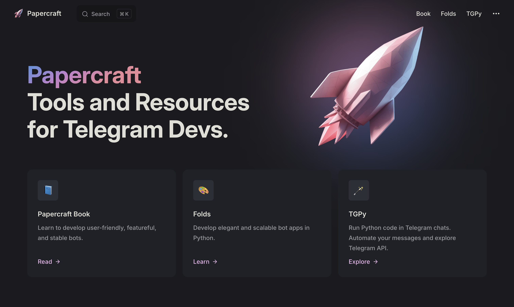

<br>
<br>


<div align="center">

<div>

</div>

# Papercraft

Tools and resources for Telegram devs.

**https://handbook.tmat.me/**

</div>

&nbsp;

<a href="https://handbook.tmat.me/">



</a>


&nbsp;

&nbsp;

## Repositories

This repo is for the Papercraft website. Other repos: 

- [Folds](https://github.com/tm-a-t/folds)
- [TGPy](https://github.com/tm-a-t/tgpy)

## Edit the site

Feel free to PR!

The pages are stored as Markdown files in the [`pages`](pages) directory.
The site is based on [Vitepress.](https://vitepress.dev/guide/what-is-vitepress)

You can just edit the files on GitHub, but if you wish to run the site locally — 
clone the repo, download `yarn` and install dependencies:

```shell
yarn
```

Then run:

```shell
yarn dev
```


