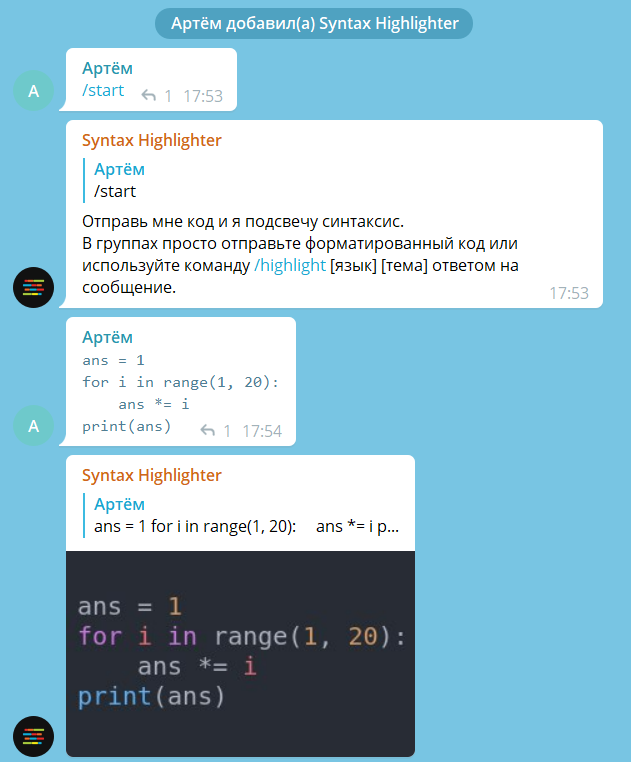
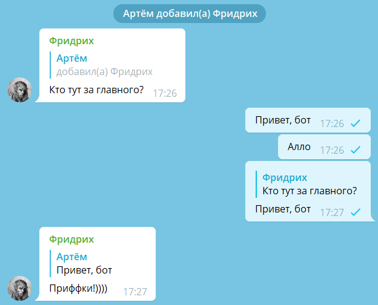

# Боты в группах

Бота можно добавить в группу. Для этого разработчик должен разрешить вступление в группы в настройках бота в BotFather.

В публичную группу — группу с юзернеймом — ботов могут добавлять только админы. Боту можно дать права администратора в
группе, чтобы он мог выполнять действия админов: например, удалять пользователей.

В одной группе может быть до 20 ботов.

## Privacy mode: видимость сообщений в группах

Обычно бот должен реагировать только на [команды](../messages/commands.md).
Телеграм не уведомляет бота об остальных сообщениях,
и это гарантирует приватность переписки для участников чата.

Тем не менее, некоторым ботам необходимо видеть другие сообщения в группе: например, если это чатбот или антиспам-бот.
Разработчики таких ботов могут отключить privacy mode.

Privacy mode — настройка в BotFather, которая по умолчанию включена. В этом режиме бот в группах видит только
те сообщения, которые могут быть обращены к нему:

- [команды](../messages/commands);
- ответы на сообщение бота, ответы на ответы и так далее,
- сообщения с [упоминанием бота](../messages/markup#упоминание-пользователя);
- системные сообщения.

Если бот — админ в группе, то он видит все сообщения, даже если privacy mode включен.

Бот, работающий через Bot API, в любом случае не будет видеть сообщения от других ботов.

В списке участников группы видно, включен ли privacy mode:

::: tip Не получается отключить privacy mode?
Если вы отключили privacy mode, бота нужно удалить из группы и добавить обратно, чтобы изменения вступили в силу.
:::

::: info Force reply {#force-reply}

Если бот с privacy mode спросил что-либо у участника группы, то сообщение участника должно быть ответом
на сообщение бота, чтобы бот увидел его.

Для того, чтобы не заставлять пользователя нажимать «Ответить»,
бот может отправить сообщение с force reply. В этом случае у пользователя автоматически начнётся ответ, как если бы
он нажал «Ответить».

Но я не рекомендую использовать force reply, потому что автоматический ответ на сообщения сбивает пользователей
с толку.
:::

## Права администратора

Когда пользователь назначает бота админом чата, он может выбрать, какие права админа ему дать. В настройках BotFather 
можно выбрать, какие права в таком случае предлагать включать по умолчанию.

Право админа на анонимность — способность отправлять сообщения от лица группы — не действует на ботов.

## Сообщения от лица групп и каналов

При разработке ботов для групп учитывайте, что сообщения в группах могут приходить не только от лица пользователей, но
также:

- из привязанного к группе канала (с точки зрения API это пересланные сообщения);
- от лица группы от анонимных администраторов той же группы;
- от лица публичных каналов от премиум-пользователей.

Корректно обрабатывайте такие случаи.

## Ссылки по теме

- [О privacy mode в документации к API](https://core.telegram.org/bots/features#privacy-mode)
