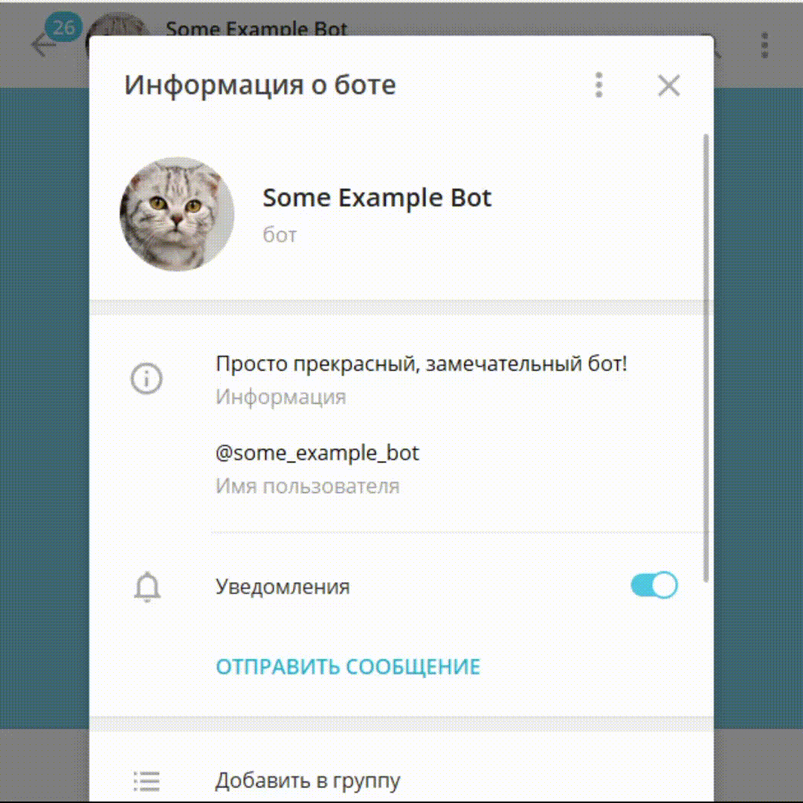

# Личные сообщения

## Начало переписки

- Бот может написать пользователю только с его разрешения.
- Бот не может писать другим ботам.
- Если диалог уже начат, бот может отправлять сообщения в любой момент.

А начать диалог пользователь может несколькими способами.

### 1. Пользователь запускает бота

Чтобы начать переписку с ботом, пользователь может открыть бота и нажать на кнопку «Запустить».

Открыть бота впервые пользователь может по ссылке/юзернейму или через поиск в приложении.
Когда пользователь запустит бота, бот будет виден в списке недавних чатов.

Впервые открыв бота, пользователь видит:

- описание бота, если оно уставлено,
- кнопку «Запустить»: в зависимости от платформы и языка пользователя она также может называться «Начать» или «Start».

Нажатие на эту кнопку отправляет команду `/start`.
Боту следует отвечать на неё приветствием или инструкцией по использованию.

::: warning
Команда `/start` не обязательно означает, что это первое сообщение от пользователя. Убедитесь, что ваш бот
не ломается, если пользователь отправил `/start` вручную уже после запуска.

Более того, первое сообщение от пользователя может не содержать команду `/start`. Через Telegram API пользователь
может начать диалог с любого сообщения. Вряд ли у вашего бота будут такие ненормальные пользователи,
но лучше проверьте, что такое действие не кладёт вашего бота.
:::

::: tip
Чтобы сообщение `/start` должно содержать дополнительную информацию, используйте [диплинки](../interaction/links).
:::

### 2. Другие способы начать переписку

Бот также может написать пользователю, если:

- пользователь оставил [заявку на вступление](../interaction/join-requests) в группу;
- пользователь авторизовался через бота на сайте [с Telegram Login Widget](../interaction/login-widget).

В начале переписки пользователь видит, по какой из этих причин бот может писать пользователю.

## Остановка переписки { #block }

Пользователь может вновь остановить диалог, заблокировав бота. Это значит, что бот снова не сможет отправлять
пользователю сообщения, пока тот его не запустит.

В последних версиях большинства официальных приложений Телеграма, блокируя бота, пользователь также очищает историю
переписки. Поэтому, если после блокировки пользователь запустит бота снова, скорее всего, пользователь уже не увидит
старые сообщения.

::: tip Как проверить, может ли бот писать пользователю
Попробуйте показать в чате с пользователем статус «Бот печатает...». Если сервера Телеграма вернули ошибку, вы не можете
писать пользователю.

Это значит, что пользователь заблокировал бота; или бот никогда не мог писать этому пользователю.
:::

## Языки пользователей

Боты видят язык, установленный у пользователя в приложении Телеграма. Таким образом ваш бот
может переписываться с пользователем на его языке.

В апдейтах не всегда отображается язык пользователя. Поэтому, если ваш бот подстраивается под языки пользователей,
для пользователя с неустановленным языком документация Телеграма рекомендует использовать последний язык, который был
известен для этого пользователя, или английский, если такого языка нет.
