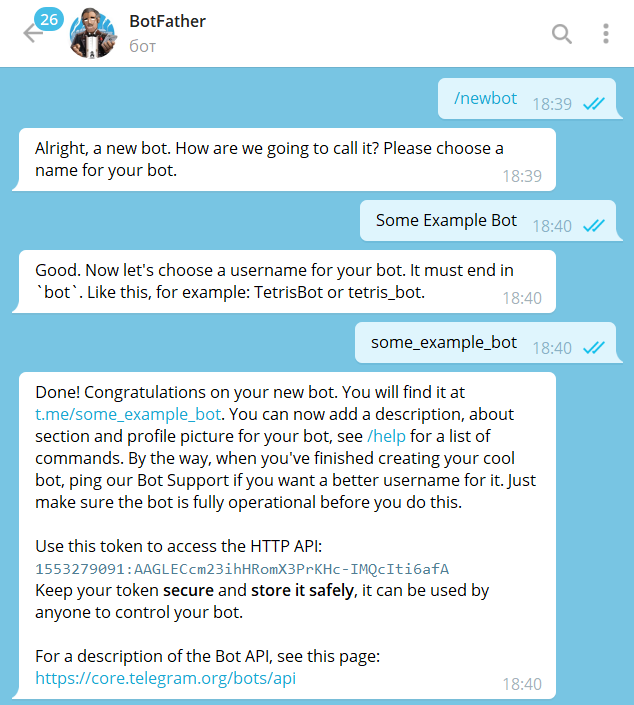
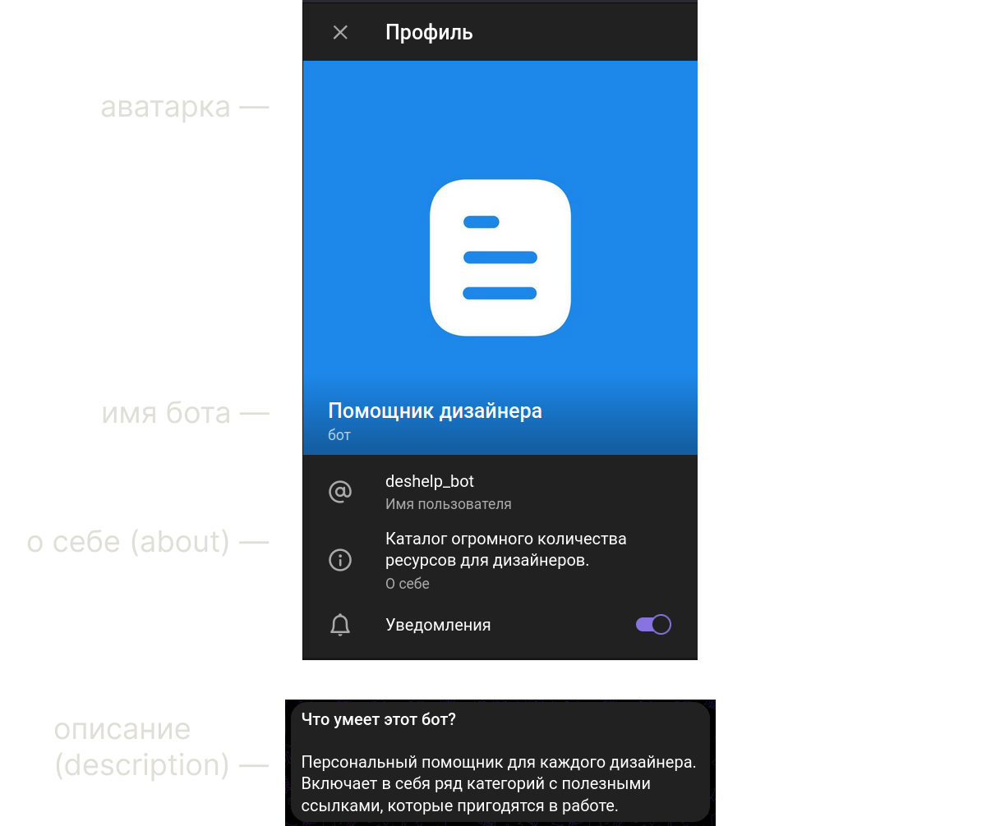

# Как зарегистрировать и настроить Телеграм-бота

## Регистрация бота

Чтобы зарегистрировать бота, напишите специальному боту [@BotFather](https://t.me/BotFather).

Он предложит создать бота с помощью команды `/new_bot`. Вы выберете название и
[юзернейм](/usernames) бота, и он создаст профиль бота.

Вы получите токен бота: например,
`110201543:AAHdqTcvCH1vGWJxfSeofSAs0K5PALDsaw`. Токен — это ключ, с помощью которого вы будете управлять ботом.

## Настройка бота

В [@BotFather](https://t.me/BotFather) вы можете использовать команду `/mybots`, чтобы изменять настройки своих ботов.
Можно
менять оформление профиля и настраивать специальные фичи: например, контролировать возможность
добавлять бота в группы.

Один пользователь может зарегистрировать до 20 ботов.

### Оформление

Чтобы поменять оформление бота, откройте меню `/mybots`, выберите бота и нажмите на `Edit bot`.

Там вы сможете настроить внешний вид бота:

Описание (description) — это текст, который пользователь увидит перед перепиской в личном чате с ботом.
К описанию вы можете добавить картинку, в том числе гифку. 
{ style="margin-top: 32px" }

::: tip
Потратьте свое время на оформление бота, чтобы пользователям было проще его использовать.
Можете оставить в описании свои контакты. Поставьте аватарку, чтобы бота было проще отличать от других чатов в
приложении.
:::

::: info
Там же вы можете поменять [подсказки команд](../messages/commands)
или [placeholder для инлайн-режима](../interaction/inline).
:::

### Передача бота

В настройках бота в BotFather можно передать право на владение ботом другому человеку. Для этого на вашем аккаунте
должна быть включена двухфакторная авторизация — не менее, чем за 7 дней до передачи. Передать бота можно только
пользователю, который что-либо ему писал.

