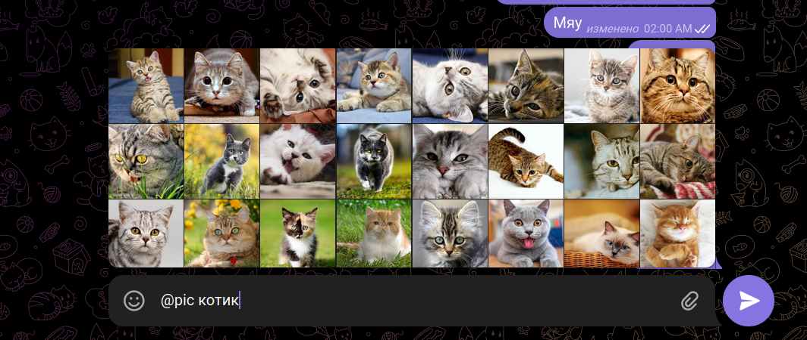
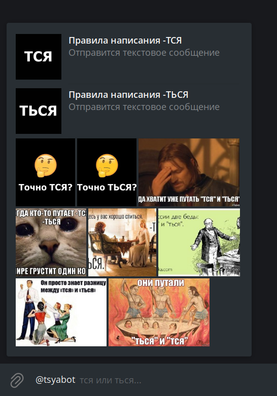
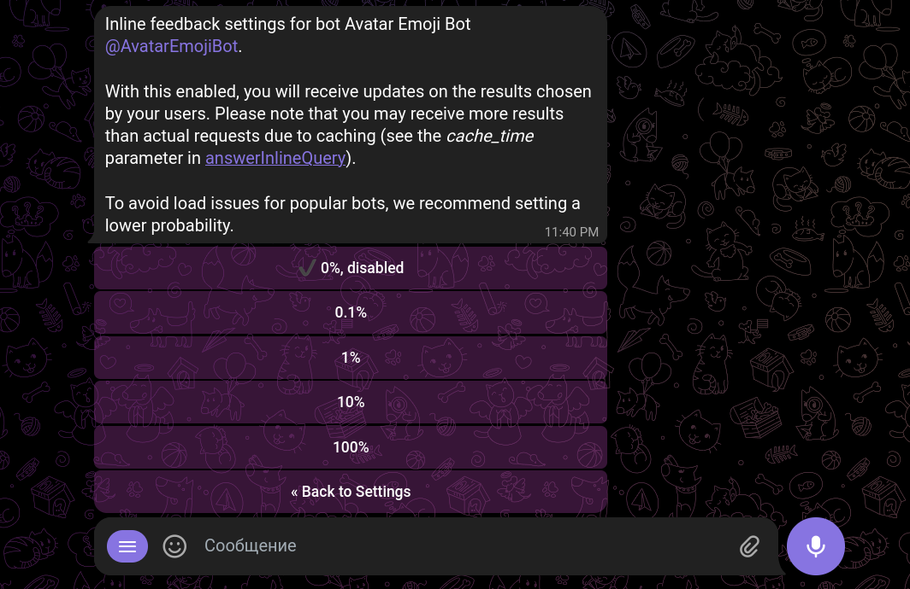

# Что такое инлайн-режим

Инлайн-режим (inline mode) — это отдельный способ использования бота.

Используя инлайн-режим, пользователь отправляет сообщение, которое сгенерировал бот.
Таким образом можно использовать бота даже в тех чатах, где его нет.

Чтобы запустить инлайн-режим, пользователь вводит юзернейм бота в поле для ввода сообщения и пробел. Если
требуется, после юзернейма он может добавить текстовый запрос: текст до 256 символов.

Появляется менюшка с результатами. Пользователь выбирает результат и таким образом отправляет сообщение.

TODO: видео

Инлайн-режим можно включить в BotFather; там же можно выбрать плейсхолдер вместо стандартного «Search...»

В группе можно запретить использовать инлайн всем или некоторым участникам. В официальных приложениях Телеграм это
ограничение объединено с ограничением на отправку стикеров и GIF.

## Отображение результатов

Результаты можно отображать сеткой (удобно для выдачи картинок) или вертикальным списком (удобно для выдачи текста).

Можно совмещать два вида, но, кажется, это отображается корректно только на Telegram Desktop.

::: details Пример

:::

## Inline feedback

Inline feedback — это апдейты о том, что юзер выбрал инлайн-результат и отправил сообщение. Чтобы получать эти
апдейты, вы должны включить inline feedback в BotFather.

Inline feedback предназначается для сбора статистики; но разработчики ботов часто используют его того, чтобы
отредактировать сообщение после отправки. Это полезно, когда нужно подгружать не все результаты сразу, а только
выбранный. Например, если бот используется для поиска музыки, то он может не загружать сразу все песни во время поиска,
а [добавить песню в сообщение](../messages/sending.md#как-изменять-медиа) только после отправки.

Важный момент: если вы получили апдейт об отправке инлайн-сообщения, то вы можете его редактировать, только если к нему
прикреплены инлайн-кнопки. (Если кнопок нет, то в апдейте не указывается id инлайн-сообщения, так что вы не сможете его
отредактировать.)

## Ссылки по теме

- [Об инлайн-запросах на сайте Телеграма](https://core.telegram.org/bots/features#inline-requests)