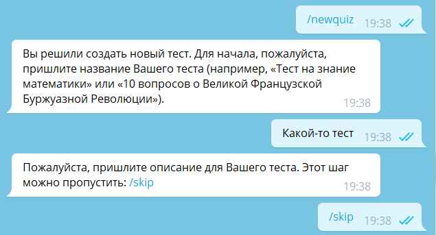
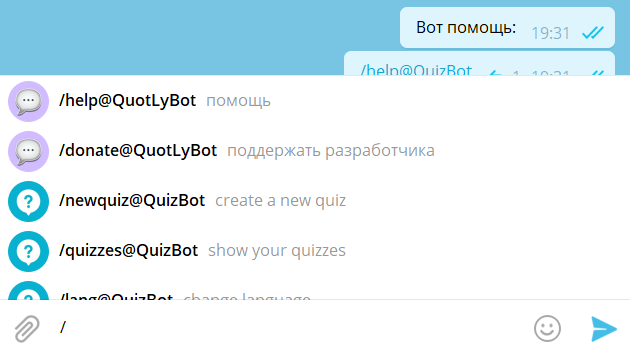

# Команды

Самый частый сценарий взаимодействия с ботом — через команды. Команды начинаются на «/» и состоят из латинских букв,
цифр и подчёркиваний.

Команды подсвечиваются как ссылки: можно нажать на команду, чтобы отправить её.

## Команды в группах

В группах, чтобы различать команды от разных ботов, Телеграм предлагает ставить в конце команды юзернейм бота.
Например: `/start@examplebot`

## Подсказки команд

Разработчик бота может указать в BotFather подсказки команд с короткими описаниями. Тогда, вводя команду в чат,
пользователь увидит
меню автодополнения.

Если у бота включены подсказки, то в личных чатах и группах с этим ботом рядом с кнопкой «Отправить» у пользователей
появляется кнопка «Меню», открывающая подсказки.

Если в подсказках команд есть `/help`, в профиле бота появляется кнопка «Помощь с ботом» для отправки этой команды.

Если в подсказках команд есть `/settings`, в профиле бота появляется кнопка «Настройки бота» для отправки этой команды.

Подсказки команд можно настраивать не только в BotFather, но и с помощью API. Таким образом бот может показывать разные
меню команд для разных пользователей и групп. Также меню команд может зависеть от языка
пользователя (это удобно для того, чтобы показывать описания команд на языке пользователя)
и от того, является ли участник группы админом (например, команды для модерации группы).
